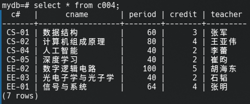
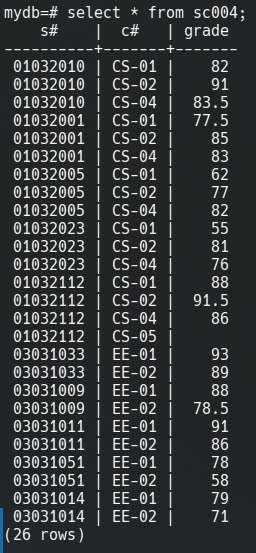

# 数据库系统实验报告

## 环境搭建

本实验采用virtualbox虚拟机安装openEuler操作系统和openGauss数据库系统, 宿主机为Arch Linux


## 实验一: 创建数据库

使用`CREATE DATABASE MYDB;`即可创建名为`MYDB`的数据库

为了编程的方便, 接下来的所有操作我都将使用JDBC完成

1. 创建`S004`表:

    ```java
    conn.prepareStatement("""
    CREATE TABLE S004 (
        S# VARCHAR(20) PRIMARY KEY,
        SNAME VARCHAR(50),
        SEX VARCHAR(10),
        BDATE DATE,
        HEIGHT FLOAT,
        DORM VARCHAR(50)
    );
    """);
    ```

2. 创建`C004`表:

    ```java
    conn.prepareStatement("""
    CREATE TABLE C004 (
        C# VARCHAR(20) PRIMARY KEY,
        CNAME VARCHAR(100),
        PERIOD INT,
        CREDIT FLOAT,
        TEACHER VARCHAR(50)
    );
    """);
    ```

3. 创建`SC004`表:

    ```java
    conn.prepareStatement("""
    CREATE TABLE SC004 (
        S# VARCHAR(20),
        C# VARCHAR(20),
        GRADE FLOAT,
        PRIMARY KEY (S#, C#),
        FOREIGN KEY (S#) REFERENCES S004(S#),
        FOREIGN KEY (C#) REFERENCES C004(C#)
    );
    """);
    ```

## 实验二: 插入数据

由于数据量较大, 此处就不展示JDBC对应代码了, 只给出插入后的数据库截图:






使用JDBC查询数据, 在终端中输出如下:


## 实验三

### 1 查询

由于查询项过多, 此处给出各查询对应的`SQL`语句, 查询结果在最后一并给出

1. 查询电子工程系(EE)所开课程的课程编号、课程名称及学分数

    ```sql
    SELECT C#, CNAME, CREDIT FROM C004 WHERE C# LIKE 'EE-%';
    ```

2. 查询未选修课程“CS-02”的女生学号及其已选各课程编号、成绩

    ```sql
    SELECT S.S#, SC.C#, SC.GRADE
    FROM S004 AS S
    JOIN SC004 AS SC ON S.S# = SC.S#
    LEFT JOIN SC004 AS SC_CS02 ON SC_CS02.S# = S.S# AND SC_CS02.C# = 'CS-02'
    WHERE SC_CS02.C# IS NULL AND S.SEX = '女';
    ```

3. 查询 2002 年~2003 年出生学生的基本信息

    ```sql
    SELECT * FROM S004
    WHERE BDATE BETWEEN '2002-01-01' AND '2003-12-31';
    ```

4. 查询每位学生的学号、学生姓名及其已选修课程的学分总数

    ```sql
    SELECT 
        S.S#, 
        S.SNAME, 
        SUM(C.CREDIT) AS TOTAL_CREDIT
    FROM 
        S004 AS S
    JOIN 
        SC004 AS SC ON S.S# = SC.S#
    JOIN 
        C004 AS C ON SC.C# = C.C#
    GROUP BY 
        S.S#, 
        S.SNAME;
    ```

5. 查询选修课程“CS-01”的学生中成绩第二高的学生学号

    ```sql
    SELECT SC.S#
    FROM SC004 AS SC
    JOIN C004 AS C ON SC.C# = C.C#
    WHERE C.C# = 'CS-01'
    AND SC.GRADE < (SELECT MAX(GRADE) FROM SC004 WHERE C# = 'CS-01' LIMIT 1)
    ORDER BY SC.GRADE DESC
    LIMIT 1;
    ```

6. 查询平均成绩超过“王涛“同学的学生学号、姓名和平均成绩, 并按学号进行降序排列

    ```sql
    WITH WangTaoAverage AS (
        SELECT AVG(GRADE) AS avg_grade
        FROM SC004
        JOIN S004 ON SC004.S# = S004.S#
        WHERE S004.SNAME = '王涛'
    )
    SELECT 
        S.S#, 
        S.SNAME, 
        AVG(SC.GRADE) AS avg_grade
    FROM 
        S004 AS S
    JOIN 
        SC004 AS SC ON S.S# = SC.S#
    GROUP BY 
        S.S#, 
        S.SNAME
    HAVING 
        AVG(SC.GRADE) > (SELECT avg_grade FROM WangTaoAverage)
    ORDER BY 
        S.S# DESC;
    ```

7. 查询选修了计算机专业全部课程(课程编号为“CS-××”)的学生姓名及已获得的学分总数

    ```sql
    WITH CS_Courses AS (
        SELECT C# 
        FROM C004 
        WHERE C# LIKE 'CS-%'
    ),
    Students_With_All_CS_Courses AS (
        SELECT SC.S#
        FROM SC004 SC
        JOIN CS_Courses CC ON SC.C# = CC.C#
        GROUP BY SC.S#
        HAVING COUNT(DISTINCT SC.C#) = (SELECT COUNT(*) FROM CS_Courses)
    )
    SELECT 
        S.SNAME, 
        SUM(C.CREDIT) AS Total_Credits
    FROM 
        S004 S
    JOIN 
        Students_With_All_CS_Courses SwA ON S.S# = SwA.S#
    JOIN 
        SC004 SC ON S.S# = SC.S#
    JOIN 
        C004 C ON SC.C# = C.C#
    GROUP BY 
        S.SNAME;
    ```

8. 查询选修了 3 门以上课程(包括 3 门)的学生中平均成绩最高的同学学号及姓名

    ```sql
    SELECT 
        S.S#, 
        S.SNAME
    FROM 
        S004 AS S
    JOIN 
        SC004 AS SC ON S.S# = SC.S#
    GROUP BY 
        S.S#, 
        S.SNAME
    HAVING 
        COUNT(SC.C#) >= 3
    ORDER BY 
        AVG(SC.GRADE) DESC
    LIMIT 1;
    ```

**查询结果**:

```txt
查询电子工程系(EE)所开课程的课程编号、课程名称及学分数
('EE-01', '信号与系统', 3.0)
('EE-02', '数字逻辑电路', 5.0)
('EE-03', '光电子学与光子学', 2.0)

==================================================

查询未选修课程“CS-02”的女生学号及其已选各课程编号、成绩
('03031011', 'EE-01', 91.0)
('03031011', 'EE-02', 86.0)
('03031009', 'EE-01', 88.0)
('03031009', 'EE-02', 78.5)

==================================================

查询 2002 年~2003 年出生学生的基本信息
('01032010', '王涛', '男', datetime.datetime(2003, 4, 5, 0, 0), 1.72, '东6舍221')
('01032005', '刘静', '女', datetime.datetime(2003, 1, 10, 0, 0), 1.63, '东1舍312')
('01032112', '董蔚', '男', datetime.datetime(2003, 2, 20, 0, 0), 1.71, '东6舍221')
('03031014', '赵思扬', '男', datetime.datetime(2002, 6, 6, 0, 0), 1.85, '东18舍421')
('03031051', '周剑', '男', datetime.datetime(2002, 5, 8, 0, 0), 1.68, '东18舍422')
('03031009', '田菲', '女', datetime.datetime(2003, 8, 11, 0, 0), 1.6, '东2舍104')
('03031033', '蔡明明', '男', datetime.datetime(2003, 3, 12, 0, 0), 1.75, '东18舍423')

==================================================

查询每位学生的学号、学生姓名及其已选修课程的学分总数
('01032010', '王涛', 9.0)
('03031051', '周剑', 8.0)
('03031009', '田菲', 8.0)
('03031011', '王倩', 8.0)
('01032001', '张晓梅', 9.0)
('01032023', '孙文', 9.0)
('03031033', '蔡明明', 8.0)
('03031014', '赵思扬', 8.0)
('01032005', '刘静', 9.0)
('01032112', '董蔚', 11.0)

==================================================

查询选修课程“CS-01”的学生中成绩第二高的学生学号
('01032010',)

==================================================

查询平均成绩超过“王涛“同学的学生学号、姓名和平均成绩, 并按学号进行降序排列
('03031033', '蔡明明', 91.0)
('03031011', '王倩', 88.5)
('01032112', '董蔚', 88.5)

==================================================

查询选修了计算机专业全部课程(课程编号为“CS-××”)的学生姓名及已获得的学分总数
('董蔚', 11.0)

==================================================

查询选修了 3 门以上课程(包括 3 门)的学生中平均成绩最高的同学学号及姓名
('01032112', '董蔚')
```

### 2 冲突插入

分别在 S×××和 C×××表中加入记录(‘01032005’, ‘刘竞’, ‘男’, ‘2003-12-10’, 1.75, ‘东 14 舍 312’)及(‘CS-03’, “离散数学”, 64, 4, ‘陈建明’)

```sql
INSERT INTO S004 (S#, SNAME, SEX, BDATE, HEIGHT, DORM) VALUES ("01032005", "刘竞", "男", "2003-12-10", 1.75, "东14舍312");
```

```sql
INSERT INTO C004 (C#, CNAME, PERIOD, CREDIT, TEACHER) VALUES ("CS-03", "离散数学", 64, 4, "陈建明");
```

得到报错:

```txt
duplicate key value violates unique constraint "s004_pkey"
DETAIL:  Key ("s#")=(01032005) already exists.
```

### 3 删除

将 S×××表中已修学分数大于 60 的学生记录删除

```sql
DELETE FROM S004
WHERE S# IN (
    SELECT S#
    FROM C004
    GROUP BY S#
    HAVING SUM(CREDIT) > 60
);
```

### 4 更新

将“张明”老师负责的“信号与系统”课程的学时数调整为 64, 同时增加一个学分

```sql
UPDATE C004
SET PERIOD = 64, CREDIT = CREDIT + 1
WHERE CNAME = '信号与系统' AND TEACHER = '张明';
```

### 5 创建视图

1. 居住在“东 18 舍”的男生视图, 包括学号、姓名、出生日期、身高等属性

    ```sql
    CREATE VIEW Boys_In_East18 AS
    SELECT 
        S#, 
        SNAME, 
        BDATE, 
        HEIGHT,
        DORM
    FROM 
        S004
    WHERE 
        DORM LIKE '东18舍%' AND SEX = '男';
    ```

2. “张明”老师所开设课程情况的视图,包括课程编号、课程名称、平均成绩等属性

    ```sql
    CREATE VIEW Courses_Taught_By_ZhangMing AS
    SELECT 
        C.C#,
        C.CNAME,
        AVG(SC.GRADE) AS AverageGrade
    FROM 
        C004 AS C
    JOIN 
        SC004 AS SC ON C.C# = SC.C#
    WHERE 
        C.TEACHER = '张明'
    GROUP BY 
        C.C#, 
        C.CNAME;
    ```

3. 所有选修了“人工智能”课程的学生视图,包括学号、姓名、成绩等属性

    ```sql
    CREATE VIEW Students_Who_Took_AI AS
    SELECT 
        S.S#,
        S.SNAME,
        SC.GRADE
    FROM 
        S004 AS S
    JOIN 
        SC004 AS SC ON S.S# = SC.S#
    WHERE 
        SC.C# = 'CS-04';
    ```

### 最终结果

```txt
==============================All Tables==============================

['c004', 'sc004', 's004', 'boys_in_east18', 'courses_taught_by_zhangming', 'students_who_took_ai']

==============================c004============================

('CS-01', '数据结构', 60, 3.0, '张军')
('CS-02', '计算机组成原理', 80, 4.0, '王亚伟')
('CS-04', '人工智能', 40, 2.0, '李蕾')
('CS-05', '深度学习', 40, 2.0, '崔昀')
('EE-02', '数字逻辑电路', 100, 5.0, '胡海东')
('EE-03', '光电子学与光子学', 40, 2.0, '石韬')
('EE-01', '信号与系统', 64, 4.0, '张明')

==============================sc004============================

('01032010', 'CS-01', 82.0)
('01032010', 'CS-02', 91.0)
('01032010', 'CS-04', 83.5)
('01032001', 'CS-01', 77.5)
('01032001', 'CS-02', 85.0)
('01032001', 'CS-04', 83.0)
('01032005', 'CS-01', 62.0)
('01032005', 'CS-02', 77.0)
('01032005', 'CS-04', 82.0)
('01032023', 'CS-01', 55.0)
('01032023', 'CS-02', 81.0)
('01032023', 'CS-04', 76.0)
('01032112', 'CS-01', 88.0)
('01032112', 'CS-02', 91.5)
('01032112', 'CS-04', 86.0)
('01032112', 'CS-05', None)
('03031033', 'EE-01', 93.0)
('03031033', 'EE-02', 89.0)
('03031009', 'EE-01', 88.0)
('03031009', 'EE-02', 78.5)
('03031011', 'EE-01', 91.0)
('03031011', 'EE-02', 86.0)
('03031051', 'EE-01', 78.0)
('03031051', 'EE-02', 58.0)
('03031014', 'EE-01', 79.0)
('03031014', 'EE-02', 71.0)

==============================s004============================

('01032010', '王涛', '男', datetime.datetime(2003, 4, 5, 0, 0), 1.72, '东6舍221')
('01032023', '孙文', '男', datetime.datetime(2004, 6, 10, 0, 0), 1.8, '东6舍221')
('01032001', '张晓梅', '女', datetime.datetime(2004, 11, 17, 0, 0), 1.58, '东1舍312')
('01032005', '刘静', '女', datetime.datetime(2003, 1, 10, 0, 0), 1.63, '东1舍312')
('01032112', '董蔚', '男', datetime.datetime(2003, 2, 20, 0, 0), 1.71, '东6舍221')
('03031011', '王倩', '女', datetime.datetime(2004, 12, 20, 0, 0), 1.66, '东2舍104')
('03031014', '赵思扬', '男', datetime.datetime(2002, 6, 6, 0, 0), 1.85, '东18舍421')
('03031051', '周剑', '男', datetime.datetime(2002, 5, 8, 0, 0), 1.68, '东18舍422')
('03031009', '田菲', '女', datetime.datetime(2003, 8, 11, 0, 0), 1.6, '东2舍104')
('03031033', '蔡明明', '男', datetime.datetime(2003, 3, 12, 0, 0), 1.75, '东18舍423')
('03031056', '曹子衿', '女', datetime.datetime(2004, 12, 15, 0, 0), 1.65, '东2舍305')

==============================boys_in_east18============================

('03031014', '赵思扬', datetime.datetime(2002, 6, 6, 0, 0), 1.85, '东18舍421')
('03031051', '周剑', datetime.datetime(2002, 5, 8, 0, 0), 1.68, '东18舍422')
('03031033', '蔡明明', datetime.datetime(2003, 3, 12, 0, 0), 1.75, '东18舍423')

==============================courses_taught_by_zhangming============================

('EE-01', '信号与系统', 85.8)

==============================students_who_took_ai============================

('01032010', '王涛', 83.5)
('01032023', '孙文', 76.0)
('01032001', '张晓梅', 83.0)
('01032005', '刘静', 82.0)
('01032112', '董蔚', 86.0)
```

## 实验四

问题一和问题二是相同的, 只是数据量不同而已. 故我将两问合并, 一起处理
